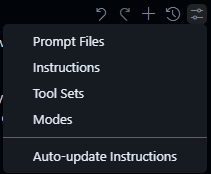
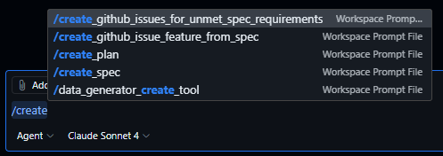

# GitHub Copilot Assets Library

There are many ways GitHub Copilot can be used to help you with not just your coding tasks, but also with ideation, problem solving, understanding, planning, research and so much more.

The biggest challenge is either creating or finding the right prompts and tools to get the most out of GitHub Copilot - and when to use them.

I've spent many hours building my own tools and prompts and chat modes to help me with my work, and I want to share them with you.

## Table of Contents

- [Asset Types Overview](#asset-types-overview)
- [Feature Comparison](#copilot-features-comparison-table)
- [Available Assets](#copilot-feature-library)
  - [Copilot Instructions](#copilot-instructions)
  - [Custom Instructions Files](#custom-instructions-files)
  - [Prompt Files](#prompt-files)
  - [Custom Chat Modes](#custom-chat-modes)
  - [Tool Sets](#tool-sets)
  - [MCP Servers](#mcp-servers)

## Asset Types Overview

This repository provides the following types of assets:

1. **Copilot Instructions**: These are custom instructions that you can add to your GitHub repository to enhance the way GitHub Copilot interacts with your code. They can be used to set the tone, style, and context of the responses you receive from Copilot. See the [Custom Instructions](https://code.visualstudio.com/docs/copilot/copilot-customization#_custom-instructions) for more information. This is available in both Visual Studio Code and Visual Studio. These can be configured at the user and workspace level.
1. **Custom Code Generation Instructions (experimental)**: These are similar to Copilot Instructions, but specifically designed for code generation tasks. They provide additional context and guidelines for generating code snippets. See the [Code Generation Instructions Examples](https://code.visualstudio.com/docs/copilot/copilot-customization#_custom-instructions-examples) for more information. This is only available in Visual Studio Code. These can be configured at the user and workspace level.
1. **Prompt Files (experimental)**: Prompt files are reusable prompts for common tasks like generating code or performing a code review. You define the prompt content in a Markdown file. A prompt file is a standalone prompt that you can run directly in chat. Optionally, you can also include guidelines about how the task should be performed. See the [Prompt Files](https://code.visualstudio.com/docs/copilot/copilot-customization#_prompt-files-experimental) for more information. This is only available in Visual Studio Code. These can be configured at the user and workspace level.
1. **Custom Chat Modes**: Aside from the core chat modes of Ask, Edit and Agent, _custom chat modes_ consist of a set of instructions and tools that are applied when you switch to that mode. For example, a "Plan" chat mode could include instructions for generating an implementation plan and only use read-only tools. By creating a custom chat mode, you can quickly switch to that specific configuration without having to manually select relevant tools and instructions each time. For more information, see the [Custom Chat Modes](https://code.visualstudio.com/docs/copilot/chat/chat-modes#_custom-chat-modes) documentation. This is only available in Visual Studio Code. These can be configured at the user and workspace level.
1. **Tool Sets**: Tool sets are collections of tools that you can use in your chats. They allow you to group related tools together and switch between different sets of tools easily. These aren't fully documented yet, but are included for completeness. Tool sets are only available in Visual Studio Code. These can only be configured at the user level.
1. **MCP Servers**: MCP servers are a way to provide additional functionality to GitHub Copilot by allowing it to call out to external services using Model Context Protocol. See the [MCP Servers](https://code.visualstudio.com/docs/copilot/chat/mcp-servers) documentation for more information. This is available in both Visual Studio Code and Visual Studio. These can be configured at the user and workspace level.

## Copilot Features Comparison Table

| Feature Name | Description | VS Code/VS Support | Configuration Level |
|--------------|-------------|--------------------|---------------------|
| Copilot Instructions | [Custom instructions](https://code.visualstudio.com/docs/copilot/copilot-customization#_custom-instructions) to set tone, style, and context for Copilot responses. | VS Code & VS | User & Workspace |
| Custom Code Generation Instructions | [Code generation instructions](https://code.visualstudio.com/docs/copilot/copilot-customization#_custom-instructions-examples) for code generation tasks. | VS Code only | User & Workspace |
| Prompt Files | [Prompt files](https://code.visualstudio.com/docs/copilot/copilot-customization#_prompt-files-experimental) are reusable prompts for common tasks. | VS Code only | User & Workspace |
| Custom Chat Modes | [Custom chat modes](https://code.visualstudio.com/docs/copilot/chat/chat-modes#_custom-chat-modes) combine instructions and tools for specific workflows. | VS Code only | User & Workspace |
| Tool Sets | Collections of tools for chat, allowing easy switching between tool groups. Not fully documented. | VS Code only | User only |
| MCP Servers | [MCP Servers](https://code.visualstudio.com/docs/copilot/chat/mcp-servers) enable Copilot to call external services via Model Context Protocol. | VS Code & VS | User & Workspace |

## Copilot Feature Library

### Copilot Instructions

Examples for Copilot Instructions can be found in subfolders in the [`copilot-instructions/`](copilot-instructions/) folder.

| Example File | Usage |
|--------------|-------|
| [copilot-instructions/azure_developer_solution_accelerator/copilot-instructions.md](copilot-instructions/azure_developer_solution_accelerator/copilot-instructions.md) | Azure Developer CLI (AZD) solution accelerator for deploying Azure resources using modern Infrastructure as Code practices. |

> [!IMPORTANT]
> Copilot Instructions only apply to Chat modes (Ask, Edit, Agent or custom modes), they do not apply to Copilot auto-completion in the editor.

#### Copilot Instructions in workspace usage

To set a custom instruction file in your repository:

1. Copy it from the subfolder in the `copilot-instructions` folder in this repository to the `.github/copilot-instructions/` folder of your repository.
1. (Optional) In Visual Studio Code, use the `Auto-update instructions` command to update the instructions in your repository based on the content of the repository and other AI tools that may have stored instructions in your repository.

    

This file will automatically apply to all contributors when they use GitHub Copilot for all file types.

### Custom Instructions Files

Custom instruction files with specific language and framework guidance can be found in the [`instructions/`](instructions/) folder.

> [!IMPORTANT]
> Copilot Instructions only apply to Chat modes (Ask, Edit, Agent or custom modes), they do not apply to Copilot auto-completion in the editor.

| Example File | Pattern | Usage |
|--------------|---------|-------|
| [csharp-14-best-practices.instructions.md](instructions/csharp-14-best-practices.instructions.md) | `**/*.cs` | C# 14 best practices and formatting guidelines for AI code generation |
| [csharp-best-practices.instructions.md](instructions/csharp-best-practices.instructions.md) | `**/*.cs` | C# best practices and formatting guidelines for AI code generation (all versions) |

#### Custom Instruction Files in workspace usage

To set a custom instruction file in your repository:

1. Copy it from the `instructions` folder in this repository to the `.github/instructions/` folder of your repository.

This file will automatically apply to all contributors when they use GitHub Copilot in the specified file types (e.g., C# files).

### Prompt Files

Prompt file examples are found in the [`prompts/`](prompts/) folder.

| Example File | Usage |
|--------------|-------|
| [create_github_issue_feature_from_spec.prompt.md](prompts/create_github_issue_feature_from_spec.prompt.md) | Generate GitHub issues for new features based on specifications. |
| [create_github_issues_for_unmet_spec_requirements.prompt.md](prompts/create_github_issues_for_unmet_spec_requirements.prompt.md) | Create GitHub issues for requirements not met in specifications. |
| [create_plan.prompt.md](prompts/create_plan.prompt.md) | Create a new implementation plan file for features, refactoring, upgrades, or architecture, optimized for Generative AI. |
| [create_spec.prompt.md](prompts/create_spec.prompt.md) | Create a new specification file for the solution, optimized for Generative AI consumption. |
| [dotnet_best_practices.prompt.md](prompts/dotnet_best_practices.prompt.md) | Review .NET code for best practices and improvements. |
| [dotnet_design_pattern_review.prompt.md](prompts/dotnet_design_pattern_review.prompt.md) | Analyze .NET code for design pattern usage and recommendations. |
| [update_avm_modules_in_bicep.prompt.md](prompts/update_avm_modules_in_bicep.prompt.md) | Update Azure Verified Modules in Bicep templates. |
| [update_llms.prompt.md](prompts/update_llms.prompt.md) | Update Large Language Model configurations and settings. |
| [update_markdown_file_index.prompt.md](prompts/update_markdown_file_index.prompt.md) | Update a markdown file section with an index/table of files from a specified folder. |
| [update_plan.prompt.md](prompts/update_plan.prompt.md) | Update an existing implementation plan file with new or updated requirements to provide new features, refactoring existing code or upgrading packages, design, architecture or infrastructure. |
| [update_spec.prompt.md](prompts/update_spec.prompt.md) | Update an existing specification file for the solution, optimized for Generative AI consumption based on new requirements or updates to any existing code. |

#### Prompt Files in workspace usage

To add a prompt file in your repository:

1. Copy it from the `prompts` folder in this repository to the `.github/prompts/` folder of your repository.
1. In Visual Studio Code, you can execute the prompt file by pressing `/` and selecting the prompt file and adding any required input variables.

    

This will run the prompt file in the chat and generate the output based on the instructions in the file.

### Custom Chat Modes

Chat mode examples are found in the [`chatmodes/`](chatmodes/) folder:

| Example File | Usage |
|--------------|-------|
| [azure_verified_modules_bicep.chatmode.md](chatmodes/azure_verified_modules_bicep.chatmode.md) | Azure Bicep: Guidance and tools for Azure Verified Modules in Bicep templates. |
| [azure_verified_modules_terraform.chatmode.md](chatmodes/azure_verified_modules_terraform.chatmode.md) | Azure Terraform: Guidance and tools for Azure Verified Modules in Terraform configurations. |
| [critical_thinking.chatmode.md](chatmodes/critical_thinking.chatmode.md) | Critical Thinking: Challenge assumptions and encourage critical thinking to ensure the best possible solution and outcomes. |
| [expert_dotnet_software_engineer.chatmode.md](chatmodes/expert_dotnet_software_engineer.chatmode.md) | .NET Expert: Advanced .NET software engineering support and best practices. |
| [expert_react_frontend_engineer.chatmode.md](chatmodes/expert_react_frontend_engineer.chatmode.md) | React Expert: Advanced React frontend development guidance. |
| [janitor.chatmode.md](chatmodes/janitor.chatmode.md) | Code Janitor: Automated code cleanup, refactoring, and maintenance. |
| [mentor.chatmode.md](chatmodes/mentor.chatmode.md) | Mentor: Guidance, support, and learning through questions and hints. |
| [plan.chatmode.md](chatmodes/plan.chatmode.md) | Planning: Generates detailed implementation plans for new features or refactoring. |
| [semantic_kernel_dotnet.chatmode.md](chatmodes/semantic_kernel_dotnet.chatmode.md) | Semantic Kernel (.NET): Create, update, refactor, explain or work with code using the .NET version of Semantic Kernel. |
| [semantic_kernel_python.chatmode.md](chatmodes/semantic_kernel_python.chatmode.md) | Semantic Kernel (Python): Create, update, refactor, explain or work with code using the Python version of Semantic Kernel. |
| [specification.chatmode.md](chatmodes/specification.chatmode.md) | Specification: Technical specification and documentation authoring mode. |

#### Custom Chat Modes in workspace usage

To add a custom chat mode in your repository:

1. Copy the chat mode file from the `chatmodes` folder in this repository to the `.github/chatmodes/` folder of your repository.
1. In Visual Studio Code, you can select the chat mode from the chat mode selector in the chat view.

    

> [!NOTE]
> You may need to restart Visual Studio Code to see the new chat mode in the chat mode selector. (Newer versions of Visual Studio Code will automatically detect new chat modes in the `.github/chatmodes/` folder).

### Tool Sets

Tool sets are collections of tools that you can use in your chats. They allow you to group related tools together and switch between different sets of tools easily.

Tool sets are only available in Visual Studio Code and can be configured at the user level. While these aren't fully documented yet by Microsoft, they are included for completeness as they provide a way to organize and streamline your development workflow.

#### Tool Sets in workspace usage

Tool sets are configured at the user level only and are not yet fully supported for workspace-level configuration. Refer to the VS Code documentation for the latest information on tool set configuration.

### MCP Servers

MCP Server configurations are found in the [`mcp/mcp.json`](mcp/mcp.json) file.

| Server Name | Usage |
|-------------|-------|
| microsoft.docs.mcp | Provides access to Microsoft Docs Model Context Protocol (MCP) for documentation and examples. |
| filesystem | Provides file system access capabilities to Copilot for reading and writing files. |
| playwright | Enables web automation and testing capabilities through Playwright. |
| github | Integrates GitHub API functionality for repository operations and management. |
| giphy | Adds GIF search and integration capabilities through the Giphy API. |
| ado | Integrates Azure DevOps API for project management and CI/CD operations. |

#### MCP Servers in workspace usage

To add an MCP server in your repository:

1. Copy the server configuration from the `mcp.json` file in the `mcp` folder of this repository to the `.vscode/mcp.json` file in your repository.

> [!NOTE]
> You can also add MCP servers to your GitHub Repository for use by Coding Agents. See the [Extending Copilot coding agent with the Model Context Protocol (MCP)](https://docs.github.com/en/copilot/how-tos/agents/copilot-coding-agent/extending-copilot-coding-agent-with-mcp) documentation for more information.
